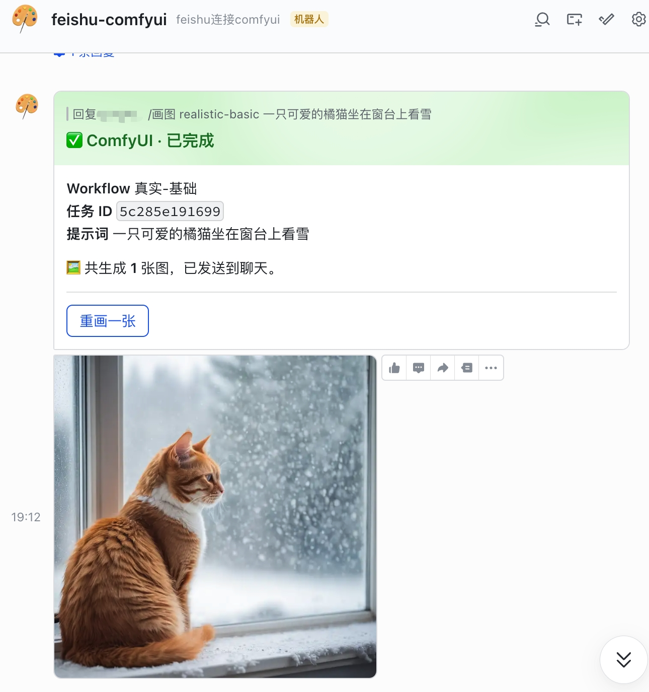

# ComfyUI · Feishu Connector

> 飞书长连接机器人:在飞书里发一条 `/画图`,本地 ComfyUI 出图,生成进度和成品图自动回到聊天。

中文输入自动翻译成英文喂给 SDXL/Flux,任务进度通过同一张可刷新卡片实时更新,完成后图片以独立消息送达。

```
飞书消息 → 长连接(WSS) → 本机 Bot → ComfyUI ←──┐
                              │                 │
                              ↓                 │
                         qwen-plus 翻译         │
                         (中文 → 英文)          │
                              │                 │
                              └─→ build_prompt ─┘
                                       ↓
              进度卡(PATCH) ←── ws/poll ── ComfyUI 出图
                                       ↓
                                   下载 + 飞书发图
```

---

## 目录

- [功能](#功能)
- [快速开始](#快速开始)
- [飞书开放平台配置](#飞书开放平台配置)
- [机器人命令](#机器人命令)
- [中文 prompt 自动翻译](#中文-prompt-自动翻译)
- [添加新 workflow](#添加新-workflow)
- [项目结构](#项目结构)
- [开发与测试](#开发与测试)
- [常见问题](#常见问题)

---


## 界面截图



## 功能

- ✅ **飞书长连接**:无需公网回调地址,Bot 通过 WebSocket 主动连飞书。
- ✅ **多 workflow**:在 `workflows/index.yaml` 注册任意 ComfyUI API JSON,机器人列出来供选择。
- ✅ **可刷新进度卡**:同一条卡片消息按节流频率 PATCH,展示百分比、状态、可点击的 取消/查看状态/重画 按钮。
- ✅ **任务持久化**:SQLite 记录每个任务的状态,支持取消、查询、重画。
- ✅ **并发控制**:`MAX_CONCURRENT_TASKS` 通过 `TaskStore.count_active()` + `asyncio.Semaphore` 双重保证。
- ✅ **中→英自动翻译**(可选):用阿里云百炼 `qwen-plus` 把中文 prompt 翻成英文再喂给 SDXL/CLIP,解决中文 prompt 跑出"无关图"的问题。
- ✅ **企业网络友好**:`truststore` 接管 SSL,自动信任 macOS Keychain / Windows Cert Store / Linux CA bundle 里的公司根证书。

---

## 快速开始

### 0. 前置条件

- Python ≥ 3.11(推荐 3.13)
- 一个能访问的 ComfyUI 服务(本机 `http://127.0.0.1:8188` 即可)
- 一个飞书企业自建应用(下文有配置步骤)

### 1. 安装

```bash
git clone git@github.com:we1005/comfyui-feishu-connector.git
cd comfyui-feishu-connector

python3 -m venv .venv
source .venv/bin/activate
pip install -e ".[dev]"
```

### 2. 配置

```bash
cp .env.example .env
```

编辑 `.env`:

| 变量 | 必填 | 说明 |
| --- | --- | --- |
| `FEISHU_APP_ID` | ✅ | 飞书开放平台 → 应用 → 凭证与基础信息 |
| `FEISHU_APP_SECRET` | ✅ | 同上 |
| `COMFYUI_BASE_URL` | ✅ | 形如 `http://192.168.x.x:8188`,Bot 所在机器要能访问到 |
| `DASHSCOPE_API_KEY` | 可选 | 阿里云百炼 API key,启用中→英翻译。留空则禁用 |
| `TRANSLATOR_MODEL` | 可选 | 默认 `qwen-plus`,可换 `qwen-flash` 提速 |
| `PROGRESS_INTERVAL_SECONDS` | 可选 | 进度卡刷新节流,默认 5 |
| `MAX_CONCURRENT_TASKS` | 可选 | 并发任务数,默认 1 |
| `LOG_LEVEL` | 可选 | `INFO` / `DEBUG` |

### 3. 准备 workflow

```bash
cp workflows/index.example.yaml workflows/index.yaml
```

往 `workflows/` 里放 ComfyUI 导出的 API 格式 JSON,然后在 `index.yaml` 里登记。详见 [添加新 workflow](#添加新-workflow)。

### 4. 启动

```bash
./run.sh
```

看到 `connected to wss://msg-frontier.feishu.cn/ws/v2...` 即连接成功,机器人开始接收消息。

---

## 飞书开放平台配置

> [开放平台](https://open.feishu.cn/) → 开发者后台 → 创建企业自建应用

### 1. 启用机器人能力

应用功能 → 机器人 → 启用。

### 2. 启用长连接事件

事件与回调 → 事件配置 → **长连接**(无需公网回调地址)。

### 3. 订阅事件

| 事件 | 用途 |
| --- | --- |
| `im.message.receive_v1` | 接收用户文字消息 |
| `application.bot.menu_v6` | 接收机器人菜单点击 |
| `card.action.trigger` | 接收卡片按钮点击(取消/查看/重画) |

### 4. 申请权限

| 权限 | 用途 |
| --- | --- |
| `im:message` | 读取消息 |
| `im:message:send_as_bot` | 以机器人身份发消息 |
| `im:resource` | 上传图片 |

### 5. 自定义菜单(推荐)

应用功能 → 机器人 → 自定义菜单:

| 菜单名 | event_key |
| --- | --- |
| 我的任务 | `my_tasks` |
| 画图列表 | `list_workflows` |
| 帮助 | `help` |

### 6. 发布

版本管理与发布 → 创建版本 → 发布上线(企业内可见)。

把 `App ID` / `App Secret` 填到 `.env`,启动 `./run.sh`,在飞书里把机器人加为联系人或加进群即可。

---

## 机器人命令

| 命令 | 行为 |
| --- | --- |
| `/help` 或 `/帮助` | 帮助卡 |
| `/画图` | 列出可用 workflow(卡片) |
| `/画图 <workflow_id> <提示词>` | 提交任务 |
| `/状态 <task_id>` | 查询任务状态 |
| `/取消 <task_id>` | 取消任务(队列中直接 cancel,运行中调 ComfyUI `interrupt`) |

提交任务后会回一张卡片:

```
🕒 ComfyUI · 排队中
Workflow  真实-基础
任务 ID   5c285e191699
提示词    一只可爱的橘猫坐在窗台上看雪
[取消任务] [查看状态]
```

进度刷新时同一条卡片 PATCH 到:

```
🎨 ComfyUI · 生成中
████████░░░░░░░░░░░░ 40%
```

完成后:

```
✅ ComfyUI · 已完成
🖼️ 共生成 1 张图,已发送到聊天。
[重画一张]
```

群聊里需要 `@机器人` 触发命令;私聊直接发即可。

---

## 中文 prompt 自动翻译

SDXL / Juggernaut XL / 大多数开源模型用的是 OpenAI 的 CLIP(ViT-L/14 + ViT-bigG),**只懂英文**。直接发中文 prompt,生成的图会和你描述的内容毫无关系——CLIP 把中文 token 当 OOV 处理,模型只能凭随机的"训练数据片段"画图。

**解决方案**:在 `.env` 里填 `DASHSCOPE_API_KEY`,启动 Bot 后会看到:

```
INFO comfyui_feishu.main: translator enabled (model=qwen-plus)
```

之后机器人收到中文 prompt 时会自动调阿里云百炼 `qwen-plus` 翻成英文(同时保留所有视觉细节、加上必要的修饰词),再喂给 ComfyUI。日志里能看到:

```
INFO comfyui_feishu.bot_service: translated task 5c285e... ->
  'a cute orange cat sitting on a windowsill, gazing at falling snow,
   soft natural light, cozy winter atmosphere, detailed fur texture, ...'
```

> 卡片上仍显示原始中文,只在后台用英文跑模型;翻译失败会自动回退到原文。
>
> 不想用阿里云?把 `DASHSCOPE_BASE_URL` 改成任何兼容 OpenAI Chat Completions 的 endpoint(自部署 vLLM、OpenAI 官方、月之暗面、智谱、字节豆包...)即可,模型名通过 `TRANSLATOR_MODEL` 指定。

---

## 添加新 workflow

1. ComfyUI 里搭好 workflow,Settings → 启用 `Dev Mode Options` → 导出 **API 格式**(`Save (API Format)`)。
   - 判别:API 格式顶层是 `{"3": {...}, "4": {...}}` 这种数字键;UI 格式顶层是 `{"nodes": [...], "links": [...]}`。**API 格式才能用**。
2. 把 JSON 放到 `workflows/`。
3. 在 `workflows/index.yaml` 加一条:

   ```yaml
   - id: my_workflow
     name: 我的 workflow
     description: 简短描述
     file: my_workflow.api.json
     positive_prompt:
       node_id: "6"          # CLIPTextEncode 正向提示词节点的字符串 key
       input: text
     negative_prompt:        # 可选
       node_id: "7"
       input: text
       default: "low quality, blurry"
     seed:                   # 可选
       node_id: "3"
       input: seed
       randomize: true
     width:                  # 可选
       node_id: "5"
       input: width
       default: 1024
     height:                 # 可选
       node_id: "5"
       input: height
       default: 1024
   ```

`workflow_registry` 会在启动时校验:JSON 里若没有这些 `node_id` / `input`,会立即抛错——配错不会等到第一条用户消息才暴露。

---

## 项目结构

```
src/comfyui_feishu/
├── main.py              # 入口,装配 BotService 各依赖
├── config.py            # pydantic-settings 读 .env
├── feishu_bot.py        # FeishuMessenger + FeishuLongConnectionBot,lark-oapi 适配层
├── bot_service.py       # 业务编排:命令分发、任务调度、卡片刷新
├── commands.py          # 中文命令解析(/画图、/状态、/取消...)
├── comfy_client.py      # ComfyUI HTTP + WS 客户端
├── workflow_registry.py # 加载 + 校验 workflows/index.yaml
├── task_store.py        # SQLite 任务状态机
├── card_builder.py      # 飞书卡片 schema 2.0 构造
├── translator.py        # 中→英 prompt 翻译(可选)
└── logging_config.py
workflows/
├── index.example.yaml
└── *.api.json           # ComfyUI 导出的 API 格式 workflow
scripts/
├── build_ca_bundle.sh   # 合并 certifi + macOS keychain → data/ca-bundle.pem
└── smoke_e2e.py
tests/                   # pytest, asyncio_mode=auto
```

`Messenger` Protocol 是 `bot_service` 与 lark SDK 的解耦边界,所有测试用 fake messenger 即可。

---

## 开发与测试

```bash
pytest                          # 所有测试
pytest tests/test_commands.py   # 单文件
pytest -k draw                  # 关键字过滤
```

> 没配置 linter / formatter。`pyproject.toml` 设了 `asyncio_mode = "auto"`,async 测试不需要 `@pytest.mark.asyncio`。

---

## 常见问题

<details>
<summary><b>跑出来的图和提示词完全无关</b></summary>

SDXL CLIP 不懂中文。配置 `DASHSCOPE_API_KEY` 启用翻译层,或者直接用英文 prompt。详见 [中文 prompt 自动翻译](#中文-prompt-自动翻译)。
</details>

<details>
<summary><b>飞书报 230099 / cards of schema V2 no longer support this capability</b></summary>

飞书新版卡片(schema 2.0)废弃了一批旧 tag(如 `tag: action`、`tag: progress_bar`)。本项目已全部改成 `column_set` + 普通 `markdown`。如果你扩展了卡片,注意只用新 schema 支持的 tag。
</details>

<details>
<summary><b>启动时报 SSL CERTIFICATE_VERIFY_FAILED</b></summary>

公司网络 MITM。先把根证书安装到 OS 信任库(macOS: 双击导入 Keychain 并勾选"始终信任"),`truststore` 会自动接管。仍不行就跑 `./scripts/build_ca_bundle.sh` 生成合并 bundle。
</details>

<details>
<summary><b>用户发了消息但日志里完全没动静</b></summary>

1. 飞书后台 `im.message.receive_v1` 没订阅;
2. App 还在草稿状态,版本未发布;
3. 机器人没被加进群(群聊场景)。

打开 `LOG_LEVEL=DEBUG`,如果连 ws 帧都没看到 → 一定是飞书没推过来,跟代码无关。
</details>

<details>
<summary><b>翻译质量不满意 / 想换模型</b></summary>

改 `.env` 的 `TRANSLATOR_MODEL`(可选 `qwen-plus` / `qwen-flash` / `qwen-max` 等),或改 `DASHSCOPE_BASE_URL` 切换到任何 OpenAI 兼容服务。系统提示词在 `src/comfyui_feishu/translator.py` 顶部,按需调整。
</details>

---

## License

MIT
